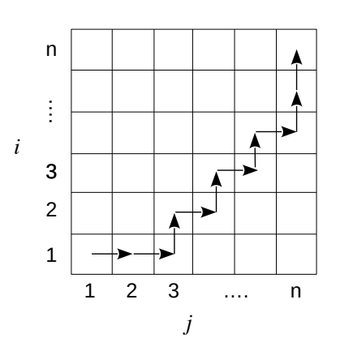

# Esercizio 22 — Cammino minimo in una griglia

## Traccia

Si supponga di avere una scacchiera $n \times n$. Si vuole spostare un pezzo dall'angolo in basso a sinistra $(1,1)$ a quello in alto a destra $(n,n)$.

Il pezzo può muoversi di una casella verso l'alto o verso destra.

Un passo dalla casella $(i,j)$ ha un costo $u(i,j)$ se verso l'alto e $r(i,j)$ se verso destra.

Realizzare un algoritmo `MinPath(u,r,n)` che dati in input gli array `u[1..n, 1..n]` e `r[1..n, 1..n]` dei costi dei singoli passi fornisce il cammino minimo.

Più in dettaglio:

- **i.** fornire una caratterizzazione ricorsiva del costo minimo di un cammino $c(i,j)$ per andare dalla casella $(i,j)$ alla casella $(n,n)$;
- **ii.** tradurre tale definizione in un algoritmo `MinPath(u,r,n)` bottom-up o top-down con memoization che determina il costo di un cammino minimo da $(1,1)$ a $(n,n)$;
- **iii.** trasformare l'algoritmo in modo che stampi la sequenza di passi di costo minimo;
- **iv.** valutare la complessità dell'algoritmo.

## Idea

Abbiamo una scacchiera della forma:



Come detto nel testo dell'esercizio, iniziamo dal punto $(1,1)$ e vogliamo arrivare a $(n,n)$, spostandoci ad ogni passo solo di una casella verso destra oppure verso l'alto.

Definiamo $c(i,j)$ come il costo minimo di un cammino per arrivare alla casella $(n,n)$ partendo dalla casella $(i,j)$, con $i \le n$ e $j \le n$.

Inoltre, vengono definite le due matrici `u[1..n, 1..n]` e `r[1..n, 1..n]`, che rappresentano rispettivamente i costi degli spostamenti verso l'alto e verso destra.

Possiamo dare una caratterizzazione ricorsiva in base alle seguenti osservazioni:

- Se ci troviamo alla casella $(n,n)$ allora abbiamo finito, quindi il costo residuo è `0`.
- Se ci troviamo in una casella tale che $i=n$ e $j<n$, allora dobbiamo necessariamente spostarci verso destra, quindi $c(i,j) = r[i,j] + c(i,j+1)$.
- Analogamente, se $i<n$ e $j=n$, allora dobbiamo necessariamente spostarci verso l'alto, quindi $c(i,j) = u[i,j] + c(i+1,j)$.
- Altrimenti, se siamo in una casella con $i<n$ e $j<n$, allora dobbiamo valutare quale mossa conviene fare. Quindi prendiamo il costo minimo tra andare a destra oppure verso l'alto.

## Caratterizzazione ricorsiva

Quindi, definendo $c(i,j)$ come il costo minimo per arrivare alla casella $(n,n)$ partendo dalla casella $(i,j)$, una caratterizzazione ricorsiva può essere:

$$
c(i,j) = \begin{cases} 
0 & \text{if } i=n \text{ and } j=n \\
r[i,j] + c(i,j+1) & \text{if } i=n \text{ and } j<n \\
u[i,j] + c(i+1,j) & \text{if } i<n \text{ and } j=n \\
\min\{r[i,j] + c(i,j+1),\ u[i,j] + c(i+1,j)\} & \text{otherwise}
\end{cases}
$$


## Algoritmo bottom-up

Per il punto **ii** possiamo usare una tabella `C[1..n, 1..n]` ed operare in maniera bottom-up, riempiendo la tabella dall'alto verso il basso e da destra verso sinistra rispetto alla rappresentazione della griglia.

Lo pseudocodice per il punto **ii** può essere:

```text
MinPath(u, r, n)
    allocate C[1..n, 1..n]

    // caso base
    C[n,n] = 0

    // caso ultima riga: spostamento a destra
    for j = n - 1 downto 1
        C[n,j] = r[n,j] + C[n,j+1]

    // caso ultima colonna: spostamento verso l'alto
    for i = n - 1 downto 1
        C[i,n] = u[i,n] + C[i+1,n]

    // altrimenti, devo valutare il minimo
    for i = n - 1 downto 1
        for j = n - 1 downto 1
            C[i,j] = min(
                        u[i,j] + C[i+1,j],
                        r[i,j] + C[i,j+1]
                     )

    // restituisco il costo del percorso minimo
    return C[1,1]
```

## Stampa del percorso

Se volessimo anche stampare il percorso di costo minimo ottenuto, potremmo modificare l'algoritmo sopra usando una tabella `T[1..n, 1..n]` con valori `'R'` e `'U'`.

Il valore `'R'` indica che dalla casella corrente si è scelto di spostarsi a destra, mentre il valore `'U'` indica che si è scelto di spostarsi verso l'alto.

Si usano anche due variabili locali `moveUp` e `moveRight`, ma la logica dell'algoritmo rimane la stessa.

Dopodiché, la procedura `printMinPath` prende come parametro la tabella `T` per effettuare la stampa del percorso.

```text
MinPath(u, r, n)
    allocate C[1..n, 1..n]
    allocate T[1..n, 1..n]

    // caso base
    C[n,n] = 0

    // caso ultima riga: spostamento a destra
    for j = n - 1 downto 1
        C[n,j] = r[n,j] + C[n,j+1]
        T[n,j] = 'R'

    // caso ultima colonna: spostamento verso l'alto
    for i = n - 1 downto 1
        C[i,n] = u[i,n] + C[i+1,n]
        T[i,n] = 'U'

    // altrimenti, devo valutare il minimo
    for i = n - 1 downto 1
        for j = n - 1 downto 1

            moveRight = r[i,j] + C[i,j+1]
            moveUp = u[i,j] + C[i+1,j]

            if moveRight <= moveUp
                C[i,j] = moveRight
                T[i,j] = 'R'
            else
                C[i,j] = moveUp
                T[i,j] = 'U'

    // restituisco il costo del percorso minimo e la tabella delle scelte
    return C[1,1], T


printMinPath(T, n)
    i = 1
    j = 1

    while i < n or j < n
        if T[i,j] == 'R'
            print "right"
            j = j + 1
        else
            print "up"
            i = i + 1
```

## Complessità

Per il punto **iv**, la complessità temporale è data dal riempimento della tabella `C[1..n, 1..n]`.

Ogni cella viene calcolata una sola volta e ogni calcolo richiede tempo costante, quindi la complessità temporale è:

```math
\Theta(n^2)
```

Anche la complessità spaziale risulta:

```math
\Theta(n^2)
```

Infatti, per calcolare il solo costo minimo usiamo la tabella `C[1..n, 1..n]`.

Se vogliamo anche ricostruire e stampare il percorso, usiamo anche la tabella `T[1..n, 1..n]`.

Entrambe le tabelle hanno dimensione $\Theta(n^2)$, quindi la complessità spaziale totale rimane $\Theta(n^2)$.
