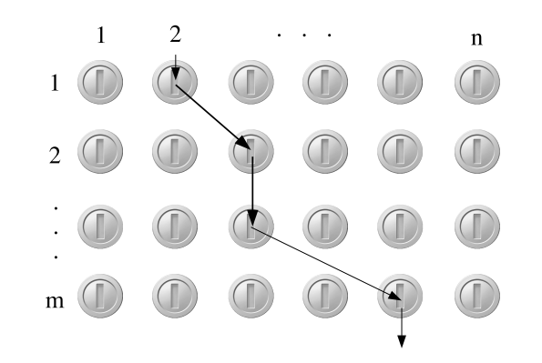

# Esercizio 27 — Attraversamento di una griglia con guadagno massimo

## Traccia

Mario deve attraversare una griglia dall'alto verso il basso e per farlo, ad ogni passo salta verso il basso di una riga, spostandosi contestualmente a destra di quanto vuole.

Ogni casella contiene una moneta di un certo valore, possibilmente negativo, per cui nell'attraversamento Mario totalizzerà un certo guadagno.

Supponendo che la griglia abbia dimensione $m \times n$ e che per $i \in \{1, \dots, m\}$ e $j \in \{1, \dots, n\}$ la casella $(i, j)$ contenga una moneta di valore $V[i,j]$, realizzare un algoritmo che identifica un attraversamento di valore massimo.

Più precisamente:

- **i.** dare una caratterizzazione ricorsiva del guadagno massimo $G[i,j]$ di un attraversamento della sottogriglia $[i \dots m, j \dots n]$;
- **ii.** usare la caratterizzazione al punto precedente per ottenere un algoritmo `mario(V,m,n)` che dato l'array `V` con il valore delle monete determini il guadagno massimo di un attraversamento;
- **iii.** trasformare l'algoritmo in modo che restituisca oltre al guadagno anche l'indicazione dell'attraversamento da seguire;
- **iv.** valutare la complessità dell'algoritmo.

## Idea

Abbiamo la seguente griglia `V[1..m, 1..n]`:



Per il punto **i** possiamo definire:

```text
G[i,j] = guadagno massimo di un attraversamento della sottogriglia [i..m, j..n],
         partendo dalla casella (i,j)
```

L'attraversamento della griglia parte sempre dalla prima riga, ovvero da `i = 1`.

Ad ogni passo Mario scende di una riga e può spostarsi contestualmente verso destra di quanto vuole. Quindi, se nella riga corrente si trova a partire dalla colonna `j`, può scegliere una qualsiasi colonna da `j` in poi, raccogliere la moneta in quella casella, e poi passare alla riga successiva senza mai tornare verso sinistra.

Possiamo quindi vedere il problema in questo modo:

- nella casella `(i,j)` possiamo decidere di raccogliere la moneta `V[i,j]` e poi continuare dalla riga successiva, sempre dalla colonna `j`;
- oppure possiamo decidere di non raccogliere la moneta in `(i,j)` e provare a scegliere una casella più a destra nella stessa riga.

Questa seconda possibilità non rappresenta un vero "passo" di Mario, ma è un modo comodo per far scorrere la DP verso destra e valutare tutte le possibili colonne in cui Mario potrebbe decidere di scendere.

Possiamo dare una caratterizzazione ricorsiva in base alle seguenti osservazioni:

- Se ci troviamo oltre l'ultima riga, ovvero in `i = m + 1`, allora l'attraversamento è finito e non possiamo più ottenere alcun guadagno. Quindi il guadagno residuo è `0`.
- Se invece ci troviamo oltre l'ultima colonna, ovvero in `j = n + 1`, siamo in una posizione impossibile, perché non abbiamo scelto nessuna casella valida nella riga corrente. In questo caso usiamo il valore sentinella `-∞`.
- Altrimenti, se ci troviamo in una casella valida `(i,j)`, dobbiamo scegliere il massimo tra raccogliere la moneta in `(i,j)` oppure spostarci logicamente verso destra e provare dalla casella `(i,j+1)`.

## Caratterizzazione ricorsiva

Quindi, per ogni coppia $(i,j)$ con $1 \le i \le m$ e $1 \le j \le n$, possiamo definire la ricorrenza per il guadagno massimo $G[i,j]$ come segue:

$$
G[i,j] =
\begin{cases}
0 & \text{se } i=m+1, \\
-\infty & \text{se } j=n+1, \\
\max\{G[i+1,j] + V[i,j],\ G[i,j+1]\} & \text{altrimenti.}
\end{cases}
$$

## Algoritmo bottom-up

Per il punto **ii** utilizziamo una tabella `G[1..m+1, 1..n+1]`, dove `G[i,j]` rappresenta il guadagno massimo di un attraversamento della griglia partendo dalla posizione `(i,j)`.

Si gestiscono prima i casi base:

- `G[m+1,j] = 0`, perché oltre l'ultima riga non c'è più alcun guadagno da ottenere;
- `G[i,n+1] = -∞`, perché oltre l'ultima colonna la posizione è impossibile.

Dopodiché, la tabella viene riempita dal basso verso l'alto e da destra verso sinistra.

```text
mario(V, m, n)
    // allocazione tabella
    allocate G[1..m+1, 1..n+1]

    // caso in cui non si ha ulteriore guadagno
    for j = 1 to n
        G[m+1,j] = 0

    // caso in cui il percorso è impossibile
    for i = 1 to m
        G[i,n+1] = -∞

    // riempimento bottom-up
    for i = m downto 1
        for j = n downto 1

            // valuta scelta con il guadagno massimo
            if G[i+1,j] + V[i,j] > G[i,j+1]
                G[i,j] = G[i+1,j] + V[i,j]
            else
                G[i,j] = G[i,j+1]

    return G[1,1]
```

## Ricostruzione del percorso

Per il punto **iii**, se volessimo modificare l'algoritmo sopra per ottenere anche il percorso di guadagno massimo, ci basta tenere traccia della colonna scelta in ogni riga.

L'informazione rilevante è quando decidiamo di raccogliere una moneta in una certa casella `(i,j)`. Infatti, raccogliere la moneta in `(i,j)` significa che nella riga `i` scegliamo la colonna `j` e poi continuiamo dalla riga successiva, sempre a partire dalla colonna `j`.

Quindi usiamo una tabella `S[1..m, 1..n]`, dove `S[i,j]` indica la colonna scelta nella riga `i` quando il sottoproblema parte da `(i,j)`.

- Se scegliamo di raccogliere la moneta in `(i,j)`, allora salviamo `S[i,j] = j`.
- Se invece scegliamo di ignorare `(i,j)` e provare da `(i,j+1)`, allora copiamo la scelta migliore già calcolata per `(i,j+1)`, cioè `S[i,j] = S[i,j+1]`.

Alla fine, la procedura ausiliaria `printMario(S,m,n)` stampa una sequenza di coppie `(riga, colonna)` che rappresentano le caselle attraversate da Mario.

```text
mario(V, m, n)
    // allocazione tabelle
    allocate G[1..m+1, 1..n+1]
    allocate S[1..m, 1..n]

    // casi base
    for j = 1 to n
        G[m+1,j] = 0

    for i = 1 to m
        G[i,n+1] = -∞

    // riempimento bottom-up
    for i = m downto 1
        for j = n downto 1

            // valuta scelta con il guadagno massimo
            if G[i+1,j] + V[i,j] > G[i,j+1]
                G[i,j] = G[i+1,j] + V[i,j]
                S[i,j] = j
            else
                G[i,j] = G[i,j+1]
                S[i,j] = S[i,j+1]

    // stampa del percorso di guadagno massimo
    printMario(S, m, n)

    return G[1,1]


printMario(S, m, n)
    j = 1

    for i = 1 to m
        // stampa la casella scelta nella riga i
        print i, S[i,j]

        // nella riga successiva si può partire dalla colonna scelta
        j = S[i,j]
```

## Complessità

Per il punto **iv**, la complessità temporale deriva dal riempimento della tabella `G[1..m+1, 1..n+1]`.

Ogni cella viene calcolata una sola volta e ogni calcolo richiede tempo costante, quindi la complessità temporale dell'algoritmo è:

$$
\Theta(m \times n)
$$

La procedura di stampa del percorso visita una casella per ogni riga, quindi ha costo:

$$
\Theta(m)
$$

La complessità temporale complessiva rimane quindi:

$$
\Theta(m \times n)
$$

Per la complessità spaziale, usiamo la tabella `G[1..m+1, 1..n+1]`.

Se vogliamo anche ricostruire il percorso, usiamo anche la tabella `S[1..m, 1..n]`.

Entrambe le tabelle occupano spazio proporzionale a `m × n`, quindi la complessità spaziale totale è:

$$
\Theta(m \times n)
$$
